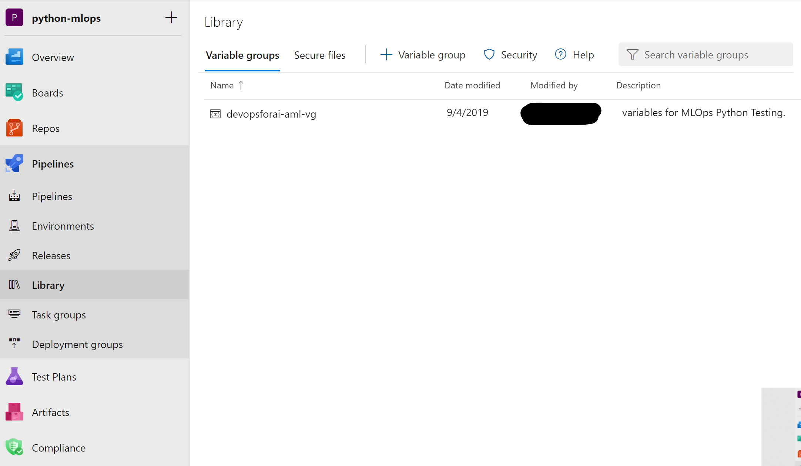
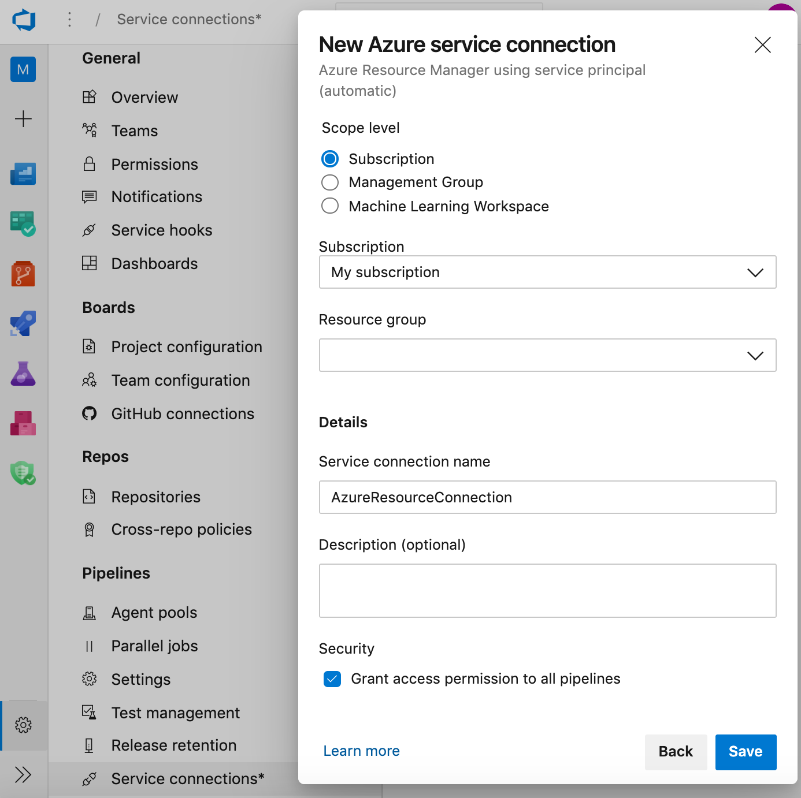
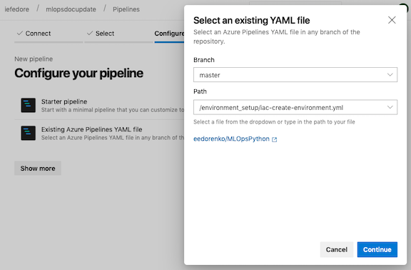
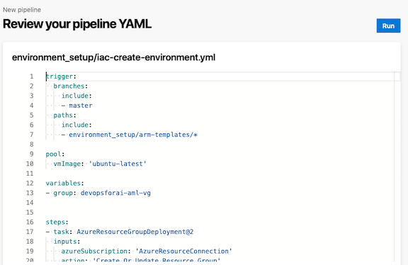
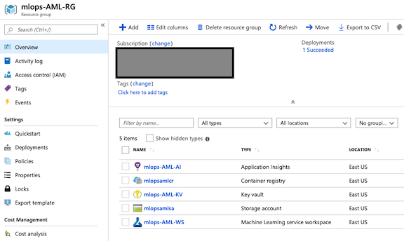
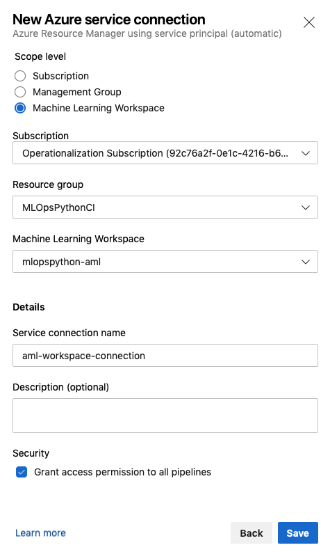
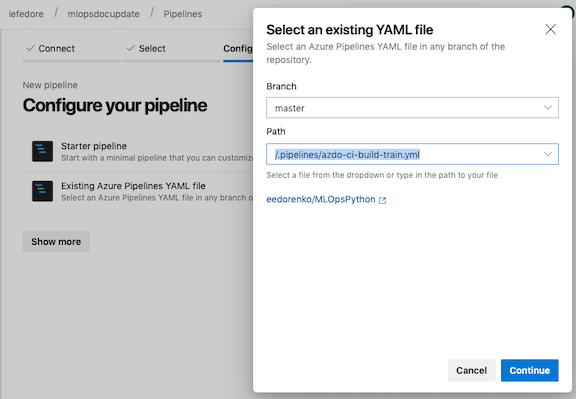
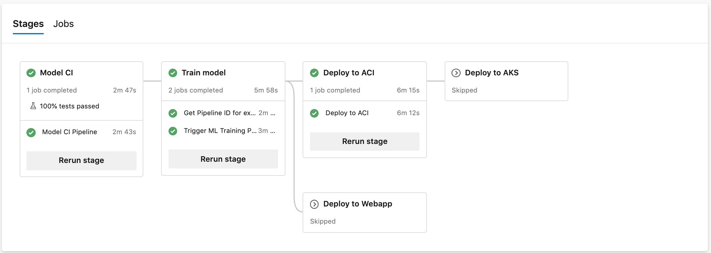
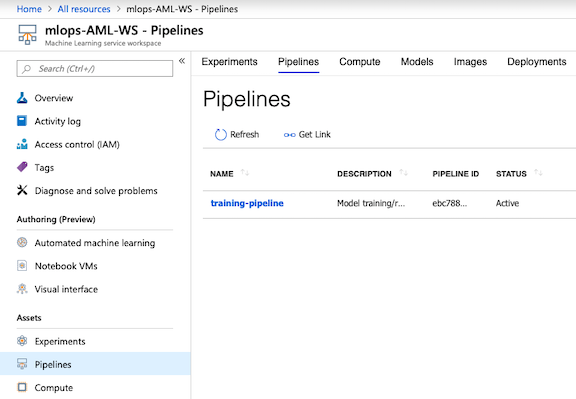
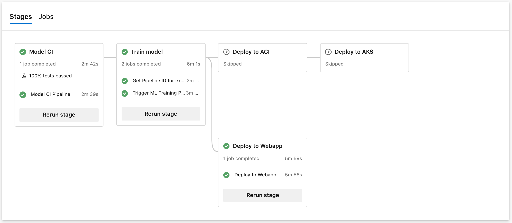

# Getting Started with this Repo

## Create an Azure DevOps organization

We use Azure DevOps for running our multi-stage pipeline with build(CI), ML training and scoring service release
(CD) stages. If you don't already have an Azure DevOps organization, create one by
following the instructions [here](https://docs.microsoft.com/en-us/azure/devops/organizations/accounts/create-organization?view=azure-devops).

If you already have an Azure DevOps organization, create a [new project](https://docs.microsoft.com/en-us/azure/devops/organizations/projects/create-project?view=azure-devops).

## Decide best option to copy repository code

* Fork this repository if there is a desire to contribute back to the repository else
* Use this [code template](https://github.com/microsoft/MLOpsPython/generate) which copies the entire code base to your own GitHub location with the git commit history restarted. This can be used for learning and following the guide.

This repository contains a template and demonstrates how to apply it to a sample ML project ***diabetes_regression*** that creates a linear regression model to predict the diabetes.

If the desire is to adopt this template for your project and to use it with your machine learning code, it is recommended to go through this guide as it is first. This ensures everything is working on your environment. After the sample is working, follow the [bootstrap instructions](../bootstrap/README.md) to convert the ***diabetes_regression*** sample into your project starting point.

## Create a Variable Group for your Pipeline

We make use of a variable group inside Azure DevOps to store variables and their
values that we want to make available across multiple pipelines or pipeline stages. You can either
store the values directly in [Azure DevOps](https://docs.microsoft.com/en-us/azure/devops/pipelines/library/variable-groups?view=azure-devops&tabs=designer#create-a-variable-group)
or connect to an Azure Key Vault in your subscription. Please refer to the
documentation [here](https://docs.microsoft.com/en-us/azure/devops/pipelines/library/variable-groups?view=azure-devops&tabs=designer#create-a-variable-group) to
learn more about how to create a variable group and
[link](https://docs.microsoft.com/en-us/azure/devops/pipelines/library/variable-groups?view=azure-devops&tabs=designer#use-a-variable-group) it to your pipeline.
Click on **Library** in the **Pipelines** section as indicated below:

Create a variable group named **``devopsforai-aml-vg``**. The YAML pipeline definitions in this repository refer to this variable group by name.

The variable group should contain the following required variables:

| Variable Name            | Suggested Value          |
| ------------------------ | ------------------------ |
| BASE_NAME                | [unique base name]       |
| LOCATION                 | centralus                |
| RESOURCE_GROUP           | mlops-RG                 |
| WORKSPACE_NAME           | mlops-AML-WS             |
| AZURE_RM_SVC_CONNECTION  | azure-resource-connection|
| WORKSPACE_SVC_CONNECTION | aml-workspace-connection |
| ACI_DEPLOYMENT_NAME      | diabetes-aci             |

**Note:**

The **WORKSPACE_NAME** parameter is used for the Azure Machine Learning Workspace creation. You can provide an existing AML Workspace here if you have one.

The **BASE_NAME** parameter is used throughout the solution for naming
Azure resources. When the solution is used in a shared subscription, there can
be naming collisions with resources that require unique names like azure blob
storage and registry DNS naming. Make sure to give a unique value to the
BASE_NAME variable (e.g. MyUniqueML), so that the created resources will have
unique names (e.g. MyUniqueMLamlcr, MyUniqueML-AML-KV, etc.). The length of
the BASE_NAME value should not exceed 10 characters and it should contain numbers and letters only.

The **RESOURCE_GROUP** parameter is used as the name for the resource group that will hold the Azure resources for the solution. If providing an existing AML Workspace, set this value to the corresponding resource group name.

The **AZURE_RM_SVC_CONNECTION** parameter is used by the [Azure DevOps pipeline]((../environment_setup/iac-create-environment.yml)) that creates the Azure ML workspace and associated resources through Azure Resource Manager. The pipeline requires an **Azure Resource Manager**
[service connection](https://docs.microsoft.com/en-us/azure/devops/pipelines/library/service-endpoints?view=azure-devops&tabs=yaml#create-a-service-connection).

Leave the **``Resource Group``** field empty.

**Note:** Creating the ARM service connection scope requires 'Owner' or 'User Access Administrator' permissions on the subscription.
You must also have sufficient permissions to register an application with
your Azure AD tenant, or receive the ID and secret of a service principal
from your Azure AD Administrator. That principal must have 'Contributor'
permissions on the subscription.

The **WORKSPACE_SVC_CONNECTION** parameter is used to reference a service connection for the Azure ML workspace. You will create this after provisioning the workspace (we recommend using the IaC pipeline as described below), and installing the Azure ML extension in your Azure DevOps project.

Optionally, a **DATASET_NAME** parameter can be used to reference a training dataset that you have registered in your Azure ML workspace (more details below).

Make sure to select the **Allow access to all pipelines** checkbox in the
variable group configuration.

## More variable options

There are more variables used in the project. They're defined in two places, one for local execution and one for using Azure DevOps Pipelines.

### Local configuration

For instructions on how to set up a local development environment, refer to the [Development environment setup instructions](development_setup.md).

### Azure DevOps configuration

For using Azure DevOps Pipelines all other variables are stored in the file `.pipelines/diabetes_regression-variables.yml`. Using the default values as a starting point, adjust the variables to suit your requirements.

**Note:** In `diabetes_regression` folder you can find `config.json` file that we would recommend to use in order to provide parameters for training, evaluation and scoring scripts. An example of a such parameter is a hyperparameter of a training algorithm: in our case it's the ridge regression [*alpha* hyperparameter](https://scikit-learn.org/stable/modules/generated/sklearn.linear_model.Ridge.html). We don't provide any special serializers for this config file. So, it's up to you which template to support there.

Up until now you should have:

* Forked (or cloned) the repo
* Configured an Azure DevOps project with a service connection to Azure Resource Manager
* Set up a variable group with all configuration values

## Create Resources with Azure Pipelines

The easiest way to create all required resources (Resource Group, ML Workspace,
Container Registry, Storage Account, etc.) is to leverage an
"Infrastructure as Code" [pipeline in this repository](../environment_setup/iac-create-environment.yml). This **IaC** pipeline takes care of setting up
all required resources based on these [ARM templates](../environment_setup/arm-templates/cloud-environment.json).

### Create a Build IaC Pipeline

In your Azure DevOps project, create a build pipeline from your forked repository:

Select the **Existing Azure Pipelines YAML file** option and set the path to [/environment_setup/iac-create-environment.yml](../environment_setup/iac-create-environment.yml):

Having done that, run the pipeline:

Check out the newly created resources in the [Azure Portal](https://portal.azure.com):

(Optional) To remove the resources created for this project you can use the [/environment_setup/iac-remove-environment.yml](../environment_setup/iac-remove-environment.yml) definition or you can just delete the resource group in the [Azure Portal](https://portal.azure.com).

**Note:** The training ML pipeline uses a [sample diabetes dataset](https://scikit-learn.org/stable/modules/generated/sklearn.datasets.load_diabetes.html) as training data. To use your own data, you need to [create a Dataset](https://docs.microsoft.com/azure/machine-learning/how-to-create-register-datasets) in your workspace and specify its name in a DATASET_NAME variable in the ***devopsforai-aml-vg*** variable group. You will also need to modify the test cases in the **ml_service/util/smoke_test_scoring_service.py** script to match the schema of the training features in your dataset.

## Create an Azure DevOps Azure ML Workspace Service Connection

Install the **Azure Machine Learning** extension to your organization from the
[marketplace](https://marketplace.visualstudio.com/items?itemName=ms-air-aiagility.vss-services-azureml),
so that you can set up a service connection to your AML workspace.

Create a service connection to your ML workspace via the [Azure DevOps Azure ML task instructions](https://marketplace.visualstudio.com/items?itemName=ms-air-aiagility.vss-services-azureml) to be able to execute the Azure ML training pipeline. The connection name specified here needs to be used for the value of the `WORKSPACE_SVC_CONNECTION` set in the variable group above.

**Note:** Creating service connection with Azure Machine Learning workspace scope requires 'Owner' or 'User Access Administrator' permissions on the Workspace.
You must also have sufficient permissions to register an application with
your Azure AD tenant, or receive the ID and secret of a service principal
from your Azure AD Administrator. That principal must have Contributor
permissions on the Azure ML Workspace.

## Set up Build, Release Trigger, and Release Multi-Stage Pipeline

Now that you have all the required resources created from the IaC pipeline,
you can set up the pipeline necessary for deploying your ML model
to production. The pipeline has a sequence of stages for:

1. **Model Code Continuous Integration:** triggered on code change to master branch on GitHub,
performs linting, unit testing and publishes a training pipeline.
1. **Train Model**: invokes the Azure ML service to trigger the published training pipeline to train, evaluate, and register a model.
1. **Release Deployment:** deploys a model to ACI, AKS and Azure App Service environments.

### Set up the Pipeline

In your [Azure DevOps](https://dev.azure.com) project create and run a new build
pipeline referring to the [diabetes_regression-ci-build-train.yml](./.pipelines/azdo-ci-build-train.yml)
pipeline definition in your forked repository:

Once the pipeline is finished, explore the execution result:

and check out the published training pipeline in the **mlops-AML-WS** workspace in [Azure Portal](https://portal.azure.com/):

Great, you now have the build pipeline set up which automatically triggers every time there's a change in the master branch.

* The first stage of the pipeline, **Model CI**, performs linting, unit testing, build and publishes an **ML Training Pipeline** in an **ML Workspace**.

  **Note:** The build pipeline also supports building and publishing ML
pipelines using R to train a model. This is enabled
by changing the `build-train-script` pipeline variable to either of:
* `diabetes_regression_build_train_pipeline_with_r.py` to train a model
with R on Azure ML Compute. You will also need to uncomment (i.e. include) the
`r-essentials` Conda packages in the environment definition
`diabetes_regression/conda_dependencies.yml`.
* `diabetes_regression_build_train_pipeline_with_r_on_dbricks.py`
to train a model with R on Databricks. You will need
to manually create a Databricks cluster and attach it to the ML Workspace as a
compute (Values DB_CLUSTER_ID and DATABRICKS_COMPUTE_NAME variables should be
specified). Example ML pipelines using R have a single step to train a model. They don't demonstrate how to evaluate and register a model. The evaluation and registering techniques are shown only in the Python implementation. 

* The second stage of the pipeline, **Train model**, triggers the run of the ML Training Pipeline. The training pipeline will train, evaluate, and register a new model. The actual computation is performed in an [Azure Machine Learning Compute cluster](https://docs.microsoft.com/en-us/azure/machine-learning/service/how-to-set-up-training-targets#amlcompute). In Azure DevOps, this stage runs an agentless job that waits for the completion of the Azure ML job, allowing the pipeline to wait for training completion for hours or even days without using agent resources.

**Note:** If the model evaluation determines that the new model does not perform better than the previous one then the new model will not be registered and the pipeline will be cancelled.

* The third stage of the pipeline, **Deploy to ACI**, deploys the model to the QA environment in [Azure Container Instances](https://azure.microsoft.com/en-us/services/container-instances/). It then runs a *smoke test* to validate the deployment, i.e. sends a sample query to the scoring web service and verifies that it returns a response in the expected format.

The pipeline uses a Docker container on the Azure Pipelines agents to accomplish the pipeline steps. The image of the container ***mcr.microsoft.com/mlops/python:latest*** is built with this [Dockerfile](./environment_setup/Dockerfile) and it has all necessary dependencies installed for the purposes of this repository. This image serves as an example of using a custom Docker image that provides a pre-baked environment. This environment is guaranteed to be the same on any building agent, VM or local machine. In your project you will want to build your own Docker image that only contains the dependencies and tools required for your use case. This image will be more likely smaller and therefore faster, and it will be totally maintained by your team. 

Wait until the pipeline finishes and verify that there is a new model in the **ML Workspace**:

To disable the automatic trigger of the training pipeline, change the `auto-trigger-training` variable as listed in the `.pipelines\diabetes_regression-ci-build-train.yml` pipeline to `false`.  This can also be overridden at runtime execution of the pipeline.

### Deploy the Model to Azure Kubernetes Service

The final stage is to deploy the model to the production environment running on
[Azure Kubernetes Service](https://azure.microsoft.com/en-us/services/kubernetes-service).

**Note:** Creating a Kubernetes cluster on AKS is out of scope of this
tutorial, but you can find set up information
[here](https://docs.microsoft.com/en-us/azure/aks/kubernetes-walkthrough-portal#create-an-aks-cluster).

**Note:** If your target deployment environment is a K8s cluster and you want to implement Canary and/or A/B testing deployment strategies check out this [tutorial](./canary_ab_deployment.md).

In the Variables tab, edit your variable group (`devopsforai-aml-vg`). In the variable group definition, add the following variables:

| Variable Name       | Suggested Value |
| ------------------- | --------------- |
| AKS_COMPUTE_NAME    | aks             |
| AKS_DEPLOYMENT_NAME | diabetes-aks    |

Set **AKS_COMPUTE_NAME** to the *Compute name* of the Inference Cluster referencing your AKS cluster in your Azure ML Workspace.

After successfully deploying to Azure Container Instances, the next stage will deploy the model to Kubernetes and run a smoke test.

## Deploy the Model to Azure App Service (Azure Web App for containers)

Note: This is an optional step and can be used only if you are [deploying your
scoring service on Azure App Service](https://docs.microsoft.com/en-us/azure/machine-learning/service/how-to-deploy-app-service).

In the Variables tab, edit your variable group (`devopsforai-aml-vg`). In the variable group definition, add the following variable:

| Variable Name          | Suggested Value        |
| ---------------------- | ---------------------- |
| WEBAPP_DEPLOYMENT_NAME | _name of your web app_ |

Set **WEBAPP_DEPLOYMENT_NAME** to the name of your Azure Web App. This app must exist before you can deploy the model to it. 

Delete the **ACI_DEPLOYMENT_NAME** variable.

The pipeline uses the [Create Image Script](../ml_service/util/create_scoring_image.py)
to create a scoring image. The image
created by this script will be registered under Azure Container Registry (ACR)
instance that belongs to Azure Machine Learning Service. Any dependencies that
scoring file depends on can also be packaged with the container with Image
config.
[Learn more on how to create a container with AML SDK](https://docs.microsoft.com/en-us/python/api/azureml-core/azureml.core.image.image.image?view=azure-ml-py#create-workspace--name--models--image-config-).

Make sure your webapp has the credentials to pull the image from the Azure Container Registry created by the Infrastructure as Code pipeline. You could do this by following the instructions in the section [Configure registry credentials in web app](https://docs.microsoft.com/en-us/azure/devops/pipelines/targets/webapp-on-container-linux?view=azure-devops&tabs=dotnet-core%2Cyaml#configure-registry-credentials-in-web-app). Note that you must have run the pipeline once (including the Deploy to Webapp stage up to the `Create scoring image` step) so that an image is present in the registry, before you can connect the Webapp to the Azure Container Registry in the Azure Portal.

# Next steps

* You may wish to follow the [bootstrap instructions](../bootstrap/README.md) to create a starting point for your project use case.
* Use the [Convert ML experimental code to production code](https://docs.microsoft.com/azure/machine-learning/tutorial-convert-ml-experiment-to-production#use-your-own-model-with-mlopspython-code-template) tutorial which explains how to bring your machine learning code on top of this template. 
* The provided pipeline definition YAML file is a sample starting point, which you should tailor to your processes and environment.
* You should edit the pipeline definition to remove unused stages. For example, if you are deploying to ACI and AKS, you should delete the unused `Deploy_Webapp` stage.
* You may wish to enable [manual approvals](https://docs.microsoft.com/en-us/azure/devops/pipelines/process/approvals) before the deployment stages.
* You can install additional Conda or pip packages by modifying the YAML environment configurations under the `diabetes_regression` directory. Make sure to use fixed version numbers for all packages to ensure reproducibility, and use the same versions across environments.
* You can explore aspects of model observability in the solution, such as:
  * **Logging**: navigate to the Application Insights instance linked to the Azure ML Portal,
    then to the Logs (Analytics) pane. The following sample query correlates HTTP requests with custom logs
    generated in `score.py`, and can be used for example to analyze query duration vs. scoring batch size:

        let Traceinfo=traces
        | extend d=parse_json(tostring(customDimensions.Content))
        | project workspace=customDimensions.["Workspace Name"],
            service=customDimensions.["Service Name"],
            NumberOfPredictions=tostring(d.NumberOfPredictions),
            id=tostring(d.RequestId),
            TraceParent=tostring(d.TraceParent);
        requests
        | project timestamp, id, success, resultCode, duration
        | join kind=fullouter Traceinfo on id
        | project-away id1

  * **Distributed tracing**: The smoke test client code sets an HTTP `traceparent` header (per the [W3C Trace Context proposed specification](https://www.w3.org/TR/trace-context-1)), and the `score.py` code logs this header. The query above shows how to surface this value. You can adapt this to your tracing framework.
  * **Monitoring**: You can use [Azure Monitor for containers](https://docs.microsoft.com/en-us/azure/azure-monitor/insights/container-insights-overview) to monitor the Azure ML scoring containers' performance, just as for any other container.
